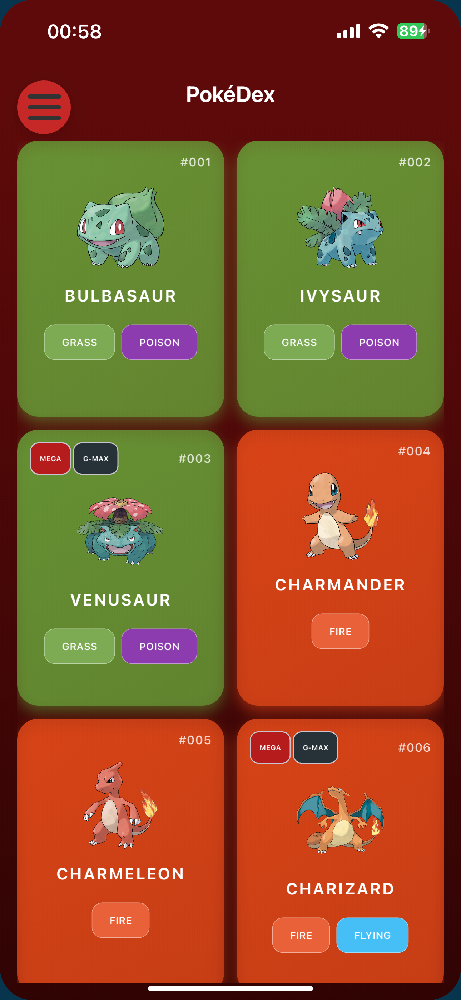
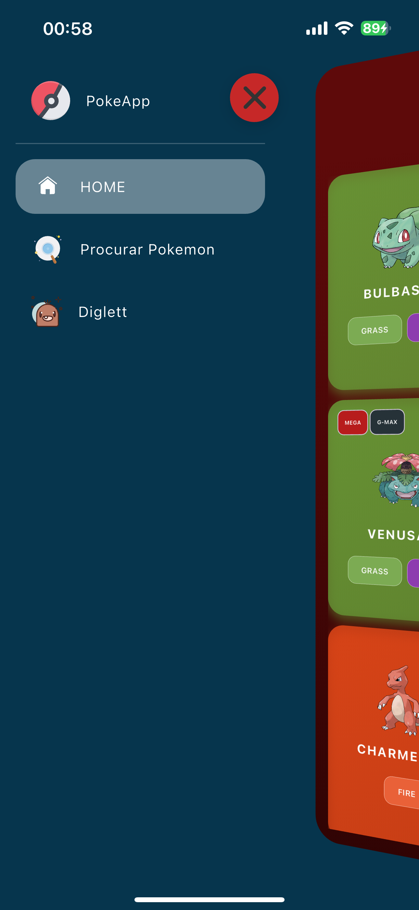
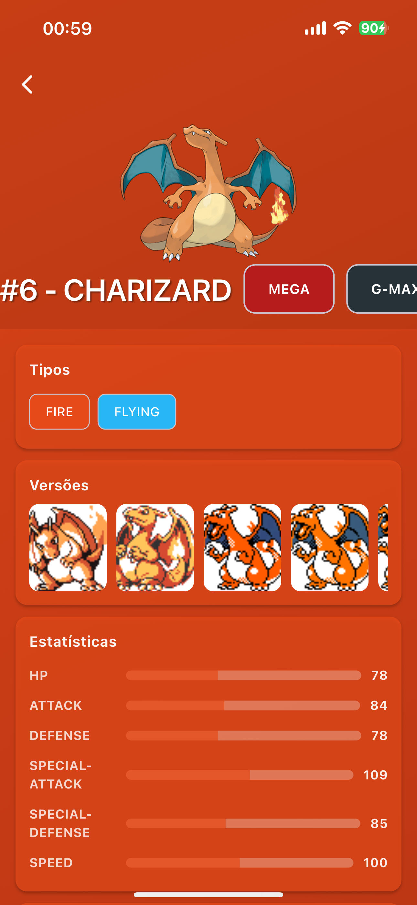

## Telas
   

[Mais imagens podem ser encontradas aqui](https://github.com/arthurlavidali/poke_app_arc/tree/main/assets/readme/imgs)

# PokeApp: Uma Pokedex com Flutter

## Visão Geral

Este projeto é uma aplicação Flutter que simula uma Pokedex, consumindo dados da [PokeAPI](https://pokeapi.co/). Desenvolvido como um estudo aprofundado em animações e otimização de performance no Flutter, o PokeApp explora diversas técnicas avançadas para criar uma experiência de usuário fluida e visualmente rica.

## Funcionalidades Principais

- **Listagem de Pokémons:** Exibe uma lista paginada de Pokémons com rolagem infinita (Utilizando Scroll Controller).
- **Detalhes do Pokémon:** Apresenta informações detalhadas de cada Pokémon.
- **Animações Avançadas:** Implementa transições e efeitos visuais complexos.
- **Performance Otimizada:** Utiliza cache de imagens e técnicas de renderização eficientes.

## Conceitos e Tecnologias Exploradas

Durante o desenvolvimento do PokeApp, os seguintes conceitos e bibliotecas foram estudados e aplicados:

 - Animações em flutter;
 - [Animações](https://api.flutter.dev/flutter/widgets/AnimatedPositioned-class.html) com icones com [LottieFiles](https://pub.dev/packages/lottie);
 - [Transformações](https://api.flutter.dev/flutter/widgets/Transform-class.html) em escala, translação e Matrix4,
 - Animações nas Transformações;
 - Técnica de [Scroll Infinito](https://api.flutter.dev/flutter/widgets/ScrollController-class.html) com ScrollController;
 - Imagens em Cache com [Cached Network Image](https://pub.dev/packages/cached_network_image) para melhorar Performance.

### Animações
Todas as animações que aprendi foi no vídeo do do [TheFlutterWay](https://www.youtube.com/@TheFlutterWay) no vídeo que ele mostra como fazer a SideBar utilizada no aplicativo que você pode conferir [clicando aqui](https://youtu.be/Z37ukFI4Ot0?si=aJRZ_lgYy5C4bb8W)

No vídeo ele ensina a trabalhar com animações em transformação em escala, translação e matrix4 de uma forma simples e rápida, além disso ele também utiliza animações de icones em formato [.riv](https://rive.app/) que é outra forma de trabalhar com icones animados usando a biblioteca [Rive](https://pub.dev/packages/rive).
No caso do meu aplicativo utilizei LottieFiles. 

- **Animações Implícitas e Explícitas:** Utilização de `AnimatedPositioned`.
- **LottieFiles:** Integração

### Transformações

Dentre as tranformações utilizei (Todas são mostradas com a SideBar aberta):
- Escala para diminuir o tamanho da tela enquando a SideBar esta aberta;
- Translação para mover a tela para a direita;
- Matrix4 para dar um efeito 3D na tela.

### Scroll Infinito

Para o Scroll Infinito foi utilizando o ScrollController dentro da GridView para identificar quando está próximo ao fim da lista, para poder fazer uma nova requisição a API e solicitar mais Pokemons para apresentação.

### Imagens em Cache

Utilizado para evitar carregar imagens de URL já carregadas anteriormente, melhorando a performance do aplicativo

